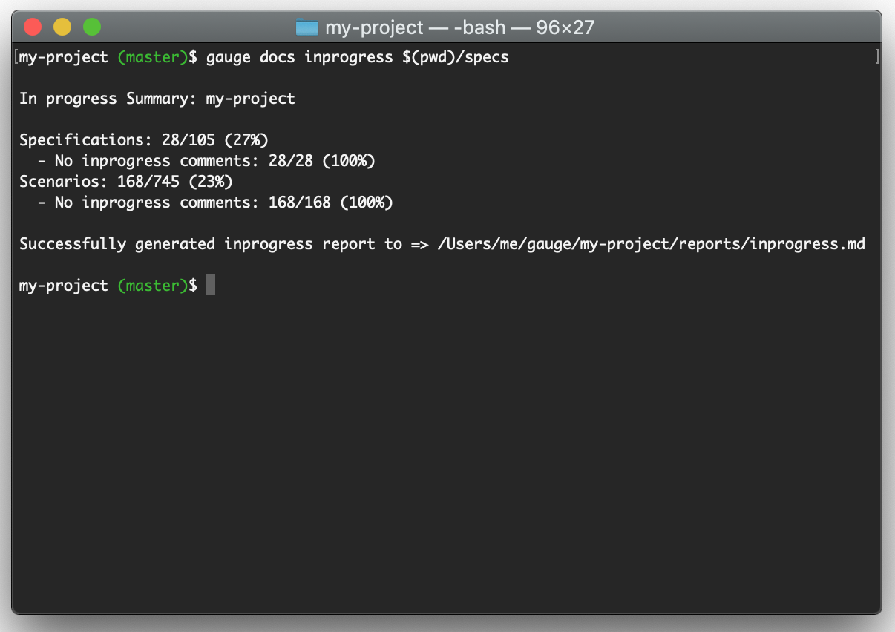

# gauge-inprogress

A Gauge plugin to keep track of specs/scenarios that are marked with work in progress (wip) tags.



The aim of this plugin is to make sure that any specs or scenarios tagged with in-progress or wip tags are trackable.
And all scenarios marked as `in-progress` tags are followed by a reason so that it's easy to revisit these accordingly.

[](https://gauge.org)

All notable changes to this project are documented in [CHANGELOG.md](CHANGELOG.md).
The format is based on [Keep a Changelog](http://keepachangelog.com/en/1.0.0/)
and adheres to [Semantic Versioning](http://semver.org/spec/v2.0.0.html).

## :hammer_and_pick: Installation

* Install the plugin

```sh
gauge install inprogress
```

### Offline installation

* Download the plugin from [Releases](../../releases)

```sh
gauge install inprogress --file inprogress-${version}.zip
```

### Using the plugin

Change to to your project's root directory.

```bash
gauge docs inprogress /absolute/path/to/specs
```

The report file will be generated under `reports/inprogress.md`

### `inprogress` comments

When adding inprogress tags to specs, you can add a comment below the tags line starting with the inprogress tag.

Example:

```markdown
# Customer sign-up

* Go to active admin store

## Customer Sign-up

tags: wip

// wip - reason for marking this as work in progress.

* Sign up a new customer with name "Jann" email "jann.doe@example.com" and "password"
* Check if the user "Jann" is logged in
* See items available for purchase.
```

### :gear: Configuration

You can also set/add the following configuration to your projects env file. `env/default/default.properties`

- `IN_PROGRESS_TAGS` - This is a comma separated list of tags to use for analysing inprogress scenarios. Default is set to `wip,in-progress`
- `IN_PROGRESS_CONSOLE_OUTPUT` - When set to true it should output the scenarios to console output.

Examples:

```properties
IN_PROGRESS_CONSOLE_OUTPUT=true
IN_PROGRESS_TAGS=wip,inprogress,my-in-progress-tag
```

## Building locally

```bash
go run build/make.go
go run build/make.go --install
```

## :wave: Issues & Contributions

Please [open an issue here](../../issues) on GitHub if you have a problem, suggestion, or other comments.

Pull requests are welcome and encouraged! Any contributions should include new or updated tests as necessary to maintain thorough test coverage.

## :scroll: License

This work is licensed under the terms of [GNU Public License version 3.0](http://www.gnu.org/licenses/gpl-3.0.txt)
